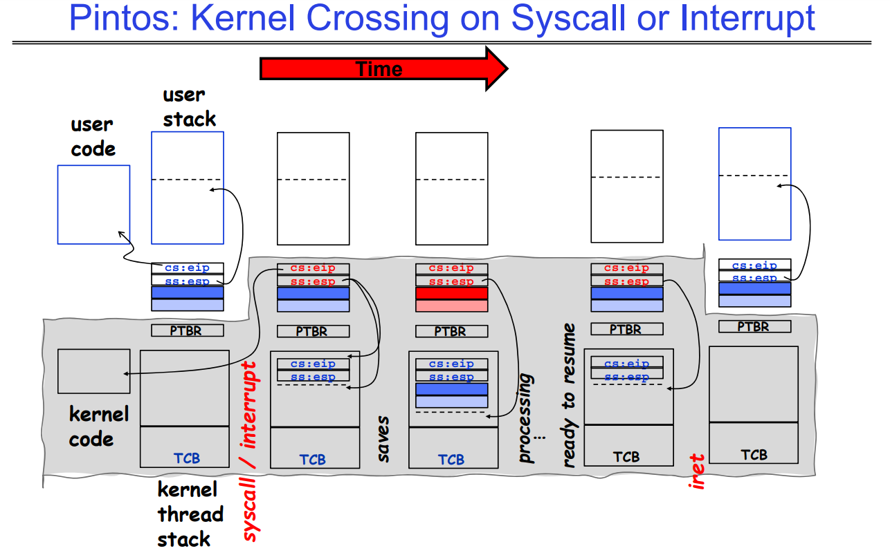
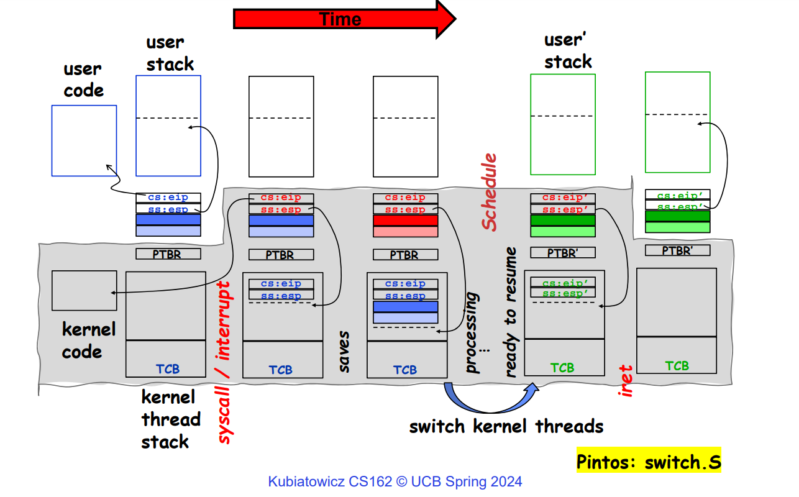
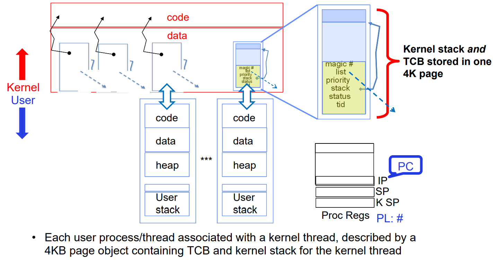
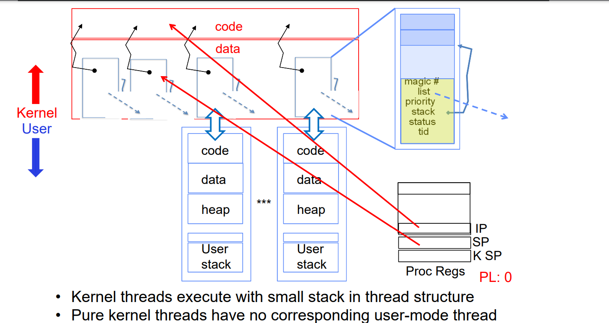
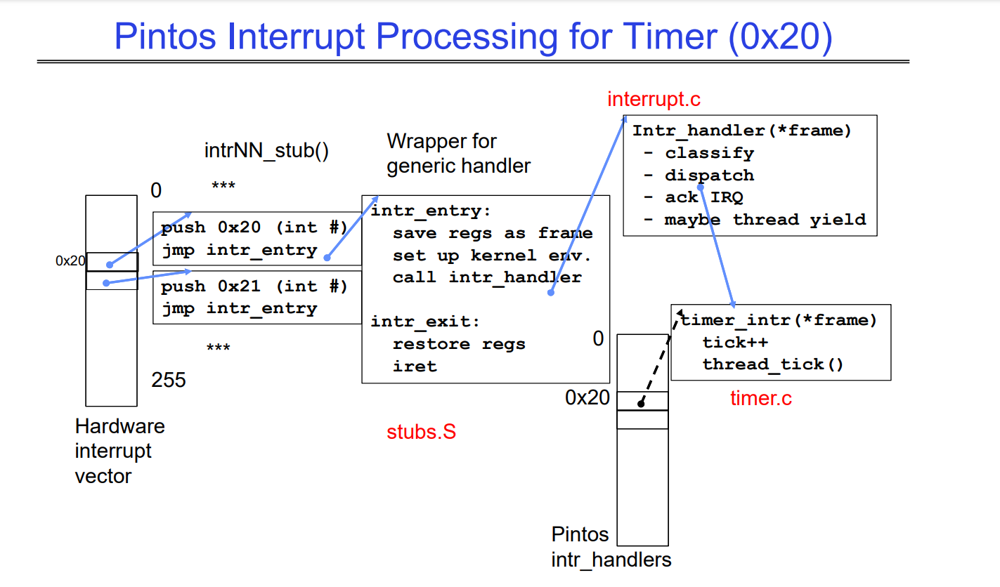
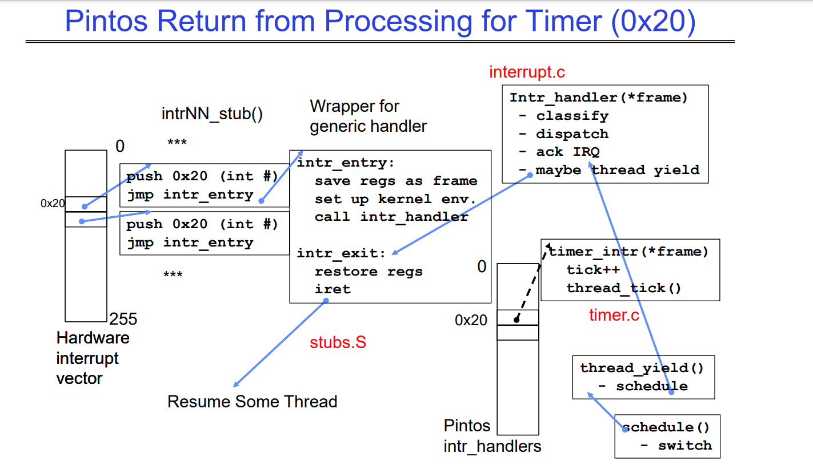
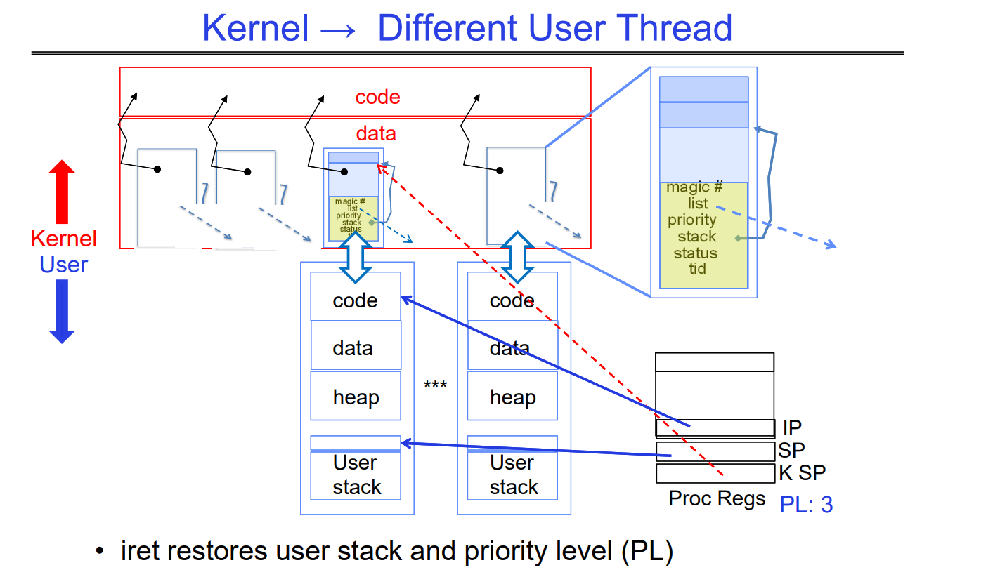

# More Synchronization and Kernel Switching Mechanism

## Monitors and Conditional Variables 
- Back to conditional being a queue of threads, these threads (some or all) if placed in the queue, will be awaken through a signal that specifies which conditional variables should be woken up. 
    - `pthread_cond_wait(pthread_cond_t *cond, pthread_mutex_t *mutex);` 
    - `int pthread_cond_signal(pthread_cond_t *cond)`
    - `int pthread_cond_broadcast(pthread_cond_t *cond);`
- Key is that the threads when placed in the queue, is sleeping. Does not produce any spin-waiting. 

```
lock buf_lock = <initially unlocked>
condition producer_CV = <initially empty>
condition consumer_CV = <initially empty>
Producer(item) {
    acquire(&buf_lock);
    while (buffer full) { cond_wait(&producer_CV, &buf_lock); }
    enqueue(item);
    cond_signal(&consumer_CV);
    release(&buf_lock);
}
Consumer() {
    acquire(buf_lock);
    while (buffer empty) { cond_wait(&consumer_CV, &buf_lock); }
    item = dequeue();
    cond_signal(&producer_CV);
    release(buf_lock);
    return item
}
```
- Internal behaviors such as `cond_wait` releasing the lock when being placed in the queue, and the threads affiliated with `cond_signal` when woken up internally trying to acquire the lock before continuing should be duly noted. 
    - When a thread is broken out of the while loop (after being signaled), the thread will first try to reacquire the lock, this ensures that signalling thread gets the chance to release the lock first and maintain the lock flow during synchronization of monitors. 


## Kernel Switching Mechanism 




- Kernel saves the the user stack information right after the syscall or interrupt. Now we do a bunch of stuff not related to the saved user stack, and then right before going back, we recede in our kernel stack to the bottom of the user stack. Then push up to the user stack again (upon `iret`). 
    - In between, likely the kernel will switch to another thread, resumes that thread whereever it was last switched (or start a new thread): 


- What this means: we have a 1-1 relation between a kernel thread stack and a running thread stack. 

But probably what is most important is the diagram giving the context: 



- **User stack is a special type of kernel thread stack that is transferrable to users**
- A 4K page consists of all that is in the kernel and user (as magnified on the right). 
- Take attention on how to distinguish kernel stack that transfers to the user and non-user kernel stack: 
    - PL (in process registers) is 0 for kernel, and 3 for user. 
    - Kernel SP might not be needed in non-user kernel stacks (given we are not using it) 
    - Also SP is always in the kernel for non-user stack trivially. 

Below is an example of the non-user kernel stack. 



### Interrupt Vector Mechanism 
- Should really be called execption vector.
- Located in the code section of the kernel. 
- Each slot has a different exception. 
- **Interrupts -> Timer | Trap -> Syscall or Page Fault** transfers through IDT (interrupt vector). 

An example of how timer triggers the switching of threads: 



- Takeaway: Context switching goes through interrupt vector, which goes through the one of the listed exections and goes through stubs.S, `intr_handler` dispatches and increment timer: 
    - `thread_tick` if quanta exceeds, sets yield flag
        - `thread_yield` sets current thread back to `READY` and push back to `ready_list`
        - if yield_flag then probably on different list. 
    - during return from interrupt, `thread_yield` calls schedule, and selects the next thread to run. 



- `iret` restores userstack and priority level (PL)



